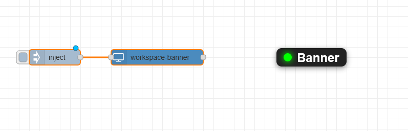
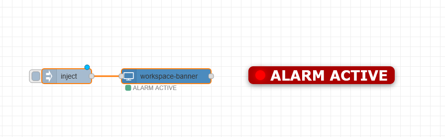

# @earthcompatible/node-red-contrib-workspace-banner

A Node-RED editor workspace banner/status overlay node.

Displays customizable live banners directly on the Node-RED design surface.

## Features

- Live workspace banners
- Dynamic text updates
- Adjustable:
  - font
  - size
  - colors
  - LED indicators
- Draggable overlays
- Coordinate positioning
- Runtime updates via msg.payload
- Selectable display per flow or global

## Install

```bash
cd ~/.node-red
npm install @earthcompatible/node-red-contrib-workspace-banner
```

## Example

```json
{
  "payload": {
    "text": "SYSTEM ONLINE",
    "backgroundColor": "#004400",
    "textColor": "#ffffff",
    "fontSize": 28,
    "showLed": true,
    "ledColor": "#00ff00"
  }
}
```

### Usage

Connect an **inject** node to the workspace-banner node. Set the inject node's payload to a JSON object with the desired banner properties.

## Message Properties

| Property | Description |
|---|---|
| text | Banner text |
| textColor | Text color |
| backgroundColor | Background color |
| fontSize | Font size |
| fontFamily | Font family |
| showLed | Show LED |
| ledColor | LED color |
| ledSize | LED size |
| x | X coordinate |
| y | Y coordinate |

## Screenshots


### Initial Status



---

### Example Alert



---

## License

MIT
